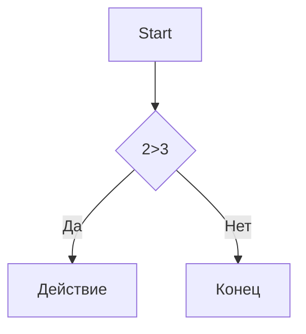

# Заголовок 1
## Заголовок 2
### Заголовок 3
#### Заголовок 4
##### Заголовок 5
###### Заголовок 6

Выделение текста
----------------

*Курсив* / _Курсив_

**Жирный** / __Жирный__

***Жирный и курсив*** / ___Жирный и курсив___

~~Зачеркнутый~~

`моноширинный код`

Списки
------

- Пункт 1
- Пункт 2
  - Вложеный
  - еще
* Пункт 3
+ Пункт 4

1. Первый
2. Второй
3. Третий
   1. Вложеный
   2. Ещё


- [x] 1
- [ ] 2
- [ ] 3

Ссылки
------

[текст ссылки](https://example.com)

[С подсказкой](https://example.com "При наведении")

<https://autolink.com>

[Ссылочный стиль][1]

[1]: https://example.com

Картинки
--------


[](https://www.leagueoflegends.com/ru-ru/champions/jinx/)

Цитата
------

>Цитата
>Много строк
>
> > Вложенная

Код
---

```python
C = a+b
print(f"{c} = {a} + {b}")
```

```markdown
print("Hello") Python
```

Таблицы
-------
:---: ориентация по центру
---: ориентация справа
:--- ориентация слева

| Name | Age | City     |
|-----:|:---:|:---------|
|SS    |34   |   M0d    |
|SS    |34   |   M0d    |
|SS    |34   |   M0d    |
|SS    |34   |   M0d    |
|SS    |34   |   M0d    |
|SS    |34   |   M0d    |

Линии
-----

---

***
___

Экранирование
-------------
\# fdf

\[ dsdssd \]

Диаграмма
---------



Заголовки
---------

- [Заголовки](#1-заголовки)
- [Списки](#3-списки)
